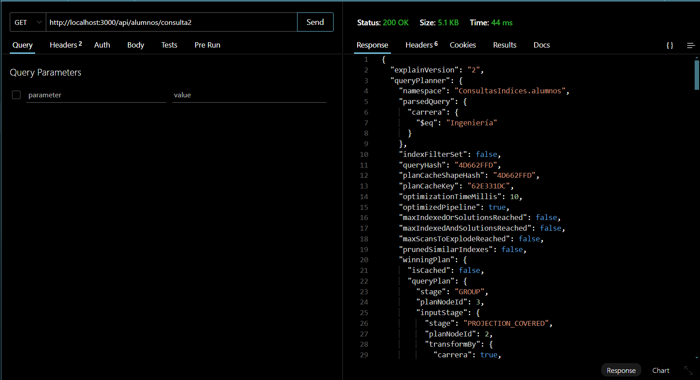

# Proyecto de Consulta de Base de Datos con y sin Índices
El objetivo de esta tarea es de configurar distintos tipos de índices en MongoDB, analizará su impacto en el rendimiento de consultas y comparará los tiempos de ejecución con y sin índices. Buscando comprender la importancia de los índices y cómo afectan la eficiencia en la recuperación de datos, usando MongoDB Shell y Node.js con Mongoose (Implementar un API).  

# **Modelo de Datos**
El modelo de datos utilizado en este proyecto es el siguiente:
{
    name: String,
    edad: Number,
    matricula: Number,
    carrera: String,
    promedio: Number,
    fecha_creacion: { type: Date, default: Date.now },
}

los campos que se utilizaron fueron:
carrera: Se utilizo para la consulta de filtro y agrupacion
promedio: Se utilizo para la consulta de filtro y ordenamiento
fecha_creacion: Se utilizo para la consulta de rango de fechas

# Descripción de las consultas

## Resultados:
En la primer consulta intente hacer lo siguiente
Con el .find se filtra la carrera: "Ingenieria", con
un promedio mayor o igual a 8  y ordenarlo de mayor a 
menor por promedio

Los resultados obtenidos fueron los siguientes:
### **Consulta 1**
Sin Indices:

| Documentos Examinados | Documentos Devueltos | Tiempo de Ejecución (ms) | 
|-----------------------|----------------------|--------------------------|
|       50,000          |        2,095         |            161           |
___________________________________________________________________________

Con Indices:
| Documentos Examinados |   Claves Examinadas  | Tiempo de Ejecución (ms) | 
|-----------------------|----------------------|--------------------------|
|         2,082         |        2,082         |            9             |
___________________________________________________________________________

Promedio de mejora: 94% más rápido.
___________________________________________________________________________

### **Consulta 2**
Agrupa los alumnos de la carrera de "Ingeniería" y calcula el promedio máximo y mínimo de los promedios.

| Documentos Examinados | Documentos Devueltos | Tiempo de Ejecución (ms) | 
|-----------------------|----------------------|--------------------------|
|         50,000        |           1          |            99            |
___________________________________________________________________________

Con Indices:
| Documentos Examinados |   Claves Examinadas  | Tiempo de Ejecución (ms) | 
|-----------------------|----------------------|--------------------------|
|          0            |       10,092         |            14            |
___________________________________________________________________________

Promedio de mejora: 86% más rápido.
___________________________________________________________________________

### **Consulta 3**
Busca alumnos desde la fecha de creación esté entre el 1 de enero de 2025 y el 31 de diciembre de 2025 (en este caso me va a devolver todos por que todos los datos fueron creados en entre esos rangos).

| Documentos Examinados | Documentos Devueltos | Tiempo de Ejecución (ms) | 
|-----------------------|----------------------|--------------------------|
|         50,000        |        50,000        |           128            |
___________________________________________________________________________

Con Indices:
| Documentos Examinados |   Claves Examinadas  | Tiempo de Ejecución (ms) | 
|-----------------------|----------------------|--------------------------|
|          112          |        50,000        |          50,000          |
___________________________________________________________________________

Promedio de mejora: 13% más rápido.
___________________________________________________________________________

# Análisis del Impacto de los Índices**
Índices Utilizados

Indice Simple en carrera:
- Mejora las consultas que filtran por carrera.

Indice Compuesto en carrera y promedio:
- Optimiza las consultas que filtran por carrera y ordenan por promedio.

Indice Simple en fecha_creacion:
- Acelera las búsquedas por rango de fechas.

**Conclusiones**
Mejora significativa en consultas con filtros y ordenamiento:

- En el casode la Consulta 1 mostró una mejora del 94% en el tiempo de ejecución al utilizar un índice compuesto en carrera y promedio.

Mejora en consultas de agregación:

- La Consulta 2 mostró una mejora del 86% al utilizar un índice en carrera.

Mejora moderada en búsquedas por fecha:

-La Consulta 3 mostró una mejora del 13% al utilizar un índice en fecha_creacion.

-Aunque el índice ayuda, el rendimiento no mejora tanto porque la consulta devuelve todos los documentos (50,000) (por los rangos de fecha que es de el año completo).

Impacto en la inserción de datos:

Los indices mejoran el rendimiento de las consultas, pero pueden ralentizar la inserción de datos ya que MongoDB debe actualizar los índices cada vez que se inserta un nuevo documento.

# **Rutas del API**

## Obteber todos los alumnos
metodo: GET 
url: http://localhost:3000/api/alumnos

## Filtro y Ordenamiento
metodo: GET 
url: http://localhost:3000/api/alumnos/consulta1

## Agregación
Metodo: GET 
url: http://localhost:3000/api/alumnos/consulta2

## Rango de Fechas
Metodo: GET 
url: GET http://localhost:3000/api/alumnos/consulta3

## Capturas de pantalla de  .explain("executionStats")
### Insertar los 50000 datos

### Consulta 1 (Filtro y Ordenamiento)

### Consulta 2 (Agregación)

### Consulta 3 (Rango de Fechas)

### Capturas del API
Todos los Alumnos:

Consulta 1:

Consulta 2:

Consulta 3:

